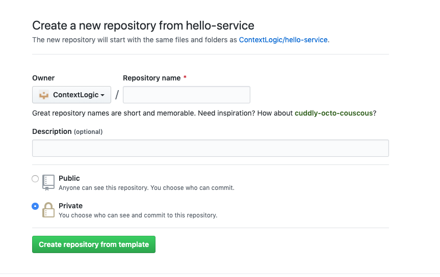

# One-Click is ready at https://one-click.i.wish.com
Please use it as your starting point to create your new micro-service. For more docs, please refer to https://wiki.wish.site/display/Infra/Create+a+New+Service

> Note: If you're creating a sideCar, do it directly from the template here. Do not use one-click


# Hello Service

This is a template `Go` hello service program that contains the skeleton for creating new microservices at Wish. It contains the following:

- Tests
- Metrics
- Protobuf defined APIs
- GRPC framework code
- Dockerfiles
- Gitlab CI files for automating the building and registering of new container images
- Tracing

## How to Use

This service is a template, and is intended to be portable when re-created. Thus, the CI and Image creation are automated, and should work out of the box.
It is important you follow the step by step instructions below.

> Note: The `.gitlab-ci.yml` and `Dockerfile` should **NOT** be modified. They are owned, and actively maintained by the Tools & Automation Team.
> If you need to write tests or add jobs please use the `templates/.ci.yml` file.

### Setting Up a New Service

#### Pre-Step - Setting up Go

> Note: If you have Go properly setup in your local environment, you can skip this step.

You'll need to install and set up your Go environment before continuing. Please follow <https://golang.org/doc/install> to install Go.

This hello service uses go mod as dependency management, this feature is only compatible with Go version >= 1.11. Please install Go version >= 1.11

Once that's setup, you should be able to create your own repo using autobots as a template repo.

#### 1. Create a Project off the Template（skip this if your repo is created by one-click)

You can setup a new service on the template page [here](https://github.com/ContextLogic/autobots/generate).

> Note: The name of the Repository should be the name of the Service.

Fill in the **Repository name**, and the **Description**. Double check the repository is set to Private.



#### 2. Migrate the Project to Gitlab

Once the project is in Github, send a message to the [#Gitlab](https://logicians.slack.com/archives/CCBSVM6S1) slack channel with the link of your new repository
asking for your repository to be linked to Gitlab.

#### 3. Clone the Repository (Skip this if your repo is created by one-click)

While you're waiting for the Github project to be ported to Gitlab, clone the new repository to your local environment
in the new repo working directory at `$GOPATH/src/github.com/ContextLogic/[repo_name_here]`.

> Caution: Make sure to clone the repository and **DO NOT USE** go get. This repo is not a library, and go get will lead to errors
> with the `go.mod` and `go.sum` files.

Switch to the directory of your new project, then run the following commands.

If you're on Linux do:

```bash
find . -type f -name "*" -not -path "./.git/*" -not -path "./.gitlab-ci.yml" -not -path "./Dockerfile" -print0 | LC_CTYPE=C xargs -0 sed -i '' -e 's/autobots/[your-repo-name]/g'

find . -type f -name "*" -not -path "./.git/*" -not -path "./.gitlab-ci.yml" -not -path "./Dockerfile" -print0 | LC_CTYPE=C xargs -0 sed -i '' -e 's/autobots/[your_repo_name_with_underscore]/g'

for FILE in $(find . -name 'autobots'); do mv $FILE $(echo $FILE | sed 's/autobots/[your_repo_name_with_underscore]/g'); done
```

If you're on Mac do:

```bash
find . -type f -name "*" -not -path "./.git/*" -not -path "./.gitlab-ci.yml" -not -path "./Dockerfile" -print0 | LC_ALL=C xargs -0 sed -i '' -e 's/autobots/[your-repo-name]/g'

find . -type f -name "*" -not -path "./.git/*" -not -path "./.gitlab-ci.yml" -not -path "./Dockerfile" -print0 | LC_ALL=C xargs -0 sed -i '' -e 's/autobots/[your_repo_name_with_underscore]/g'

for FILE in $(find . -name 'autobots'); do mv $FILE $(echo $FILE | sed 's/autobots/[your_repo_name_with_underscore]/g'); done
```

- Command 1: Replaces all instances of `autobots` with your `repo` name or `service` name.
- Command 2: Replaces all instances of `autobots` with your `repo_with_underscore` name or `service_with_underscore` name.
- Command 3: Renames all dirs named `autobots` to your `repo_with_underscore` or `service_with_underscore` names.

> Note: Make sure you put in your repo name before running it!

Now, you can commit those changes, and are ready to start writing your service!

> Caution: The generated Proto files need to be checked into Git. The pipeline doesn't generate them. **DO NOT** add them into your `.gitignore` or
> your pipeline will fail

#### 4. Testing Your Service Locally

Now that you're done with the setup steps, you're ready to test out your new service. You can run the service either using the Docker container or the
script directly. It is recommended to use Docker as this closely simulates what will happen in Production.

Follow the instructions below to setup your service for your local environment.

##### I. Set up your GITLAB CREDENTIALS

###### i. Create a Gitlab Access Token

You need to have access to Gitlab locally. Create a gitlab access token [here](https://gitlab.i.wish.com/profile/personal_access_tokens).
Make sure to give it both `api` and `read_repository` access.

###### ii. Add the TOKEN to your environment

Copy the newly created token, and set it in your environment. Open the `~/.bash_profile`, and add the below lines to the file.

```bash
export GITLAB_USERNAME=\<your gitlab username\>
export GITLAB_ACCESS_TOKEN=\<your gitlab access token\>
```

Then run the following command to set it in your environment `source ~/.bash_profile`.

###### iii. Login to the Gitlab Docker Registry

> Note: Skip this step if you're logged into the Gitlab registry
> Assumption: This step assumes you have Docker installed locally

To build the image locally, your environment also needs access to the gitlab registry at wish.

Run the following command `docker login registry-gitlab.i.wish.com -u <username> -p <access token>`

###### iiii. Config .gitconfig file and turn off GOSUMDB env var.

add the following piece to your `~/.gitconfig`

```bash
[url "ssh://git@github.com/ContextLogic"]
  insteadOf = https://github.com/ContextLogic
```

Also turn off GOSUMDB env var by

```bash
export GOSUMDB=off
```

##### II. Running your service Locally

Congratulations :tada: :confetti_ball:, you are now ready to run your service. You can do so using docker or locally.

###### i. Docker run

> Note: This is the preferred way to test your service.

To run with Docker, we have a predefined `docker-compose.yml` in your project.

Simply run the following commands in your project directory to get your service up and running:

```bash
make compose
docker-compose up --build
```

The `make compose` command will generate your protobuf files, then the `docker-compose up --build` creates a container with
your service.

To stop your container run:

```bash
docker-compose down # or ctrl+c
```

**When making changes to your GRPC server**, make sure to stop and restart your server or else changes won't be picked up.

###### ii. Local Run

Run `make all` (`sudo make all` on linux) and it will compile the protobuf definition files, build a copy of the binary under `bin/autobots`.

To run the server, execute the following command:

`bin/autobots -c=config/service.json` or use the `make run` command.

##### III. Testing your local service

To test the newly running service, you can issue a curl locally against it to test the http server:

`curl localhost:8080/status`

To test the grpc server, we recommend to use some grpc cli tools, e.g. [grpc_cli](https://github.com/grpc/grpc/blob/master/doc/command_line_tool.md#grpc-command-line-tool), [grpcurl](https://github.com/fullstorydev/grpcurl), [bloomrpc](https://github.com/uw-labs/bloomrpc)

##### IV. Integrating Services

Integrating / testing services involves several manual steps that are not automatically provided to you. Below are some instructions on how to integrate several commonly used services:

###### i. Fluent (Treasure Data)

Fluent is a logger library that hooks into `td-agent`. To integrate it, do the following:

1. Clone the Fluent logger library in the **github.com** folder your project workspace

```
cd /path/to/go/workspace/src/github.com
git clone git@github.com:fluent/fluent-logger-golang.git
```

2. Add an entry to **service.json** containing the a `fluent_config` dict with key value pairs for `host` and `port`. (see the **Configuration** step below on how to properly format it)

> Note: You will not be able to test Fluent in a `dev` environment. Once your service is deployed in production, you can check Treasure Data for results.

###### ii. Prometheus

Prometheus Monitoring is something that is provided out of the box. To integrate it, do the following:

1. Clone the `wish-metric` library in the **ContextLogic** folder of your project workspace

```
cd /path/to/go/workspace/src/github.com/ContextLogic
git clone git@github.com:ContextLogic/wish-metric.git
```

2. Verify `wish-metric` is initialized in your `server.go` file.

```
import (
 ...

 m "github.com/ContextLogic/wish-metric/pkg"

 ...
)

func execServerCmd(cmd *cobra.Command) {
 ...
 // initialize a global metric
	m.InitGlobalMetrics(cfg.BaseConfig.ServiceName)
}
```

3. When initialzing your micro-service, add and call the following method to register your metrics to Prometheus:

```
// SetupPrometheus sets up an instance of NewMetrics and registers it to Prometheus
func SetupPrometheus(cfg *config.Config) *metrics.Metrics {
 metrics := metrics.NewMetrics(cfg.BaseConfig.ServiceName)
 prometheus.MustRegister(metrics)

 metrics.Counter(
  constants.ValidationCounterName,
  "status", // a label regarding the status of an API being counted
 )

 metrics.Counter(
  constants.ActivityTypeCounterName,
  "type", // a label regarding the type of activity being counted
 )

 return metrics
}
```

4. Take a look at the following [doc](https://docs.google.com/document/d/128OQURYT8tFenX6tF2Cm6-4sEJTgGZEkO-v-BALKjpM/edit) on Prometheus to find out how and what metrics to track. Below is an example on how to increment a metrics counter in Go.

```
s.Metrics.Counter(constants.ValidationCounterName).WithLabelValues("failure").Inc()
```

5. To verify your logging events are getting recorded correctly, execute the following command while your server is running:

`curl localhost:8080/metrics`

###### iii. Sentry

To integrate Sentry, do the following:

1. Reach out to #infra to create a new sentry project (or refer to an existing sentry project)
2. For an existing project, find the Sentry DSN on <https://sentry.infra.wish.com/settings/sentry/projects/{service-name}/keys/>
3. For a new project, a more appropriate DSN will be provided to you by the engineer who created the project for you.
4. Add an entry to **service.json** containing the given `sentry_dsn` (see the **Configuration** step below on how to properly format it)

##### V. Configuration

The following configuration below is an example implementation of `service.json`, whose purpose is to configure your microservice to run in a **dev** environment:

```
{
  "base_config": {
    "service_name": "<service-name>",
    "http_port": 8080,
    "server_config": {
      "grpc_port": 8081
    },
    "shutdown_timeout": "1s",
    "shutdown_delay": "1s"
  },
  "sentry_config": {
    "sentry_dsn": "https://69e7dfc7824f4ad2b53c2d9851efe252@sentry-ingress.infra.wish.com/70"
  },
  "environment": "dev",
  "fluent_config": {
    "host": "localhost",
    "port": 8889
  }
}
```

- `base_config`: Configuration for the microservice itself
- `service_name`: The name of your service
- `http_port`: The port for receiving inbound HTTP traffic
- `server_config.grpc_port`: The port for receiving inbound GRPC traffic
- `sentry_config`: Configuration for a Sentry project for your microservice
- `sentry_dsn`: A link corresponding to any traffic that you want to route to sentry. This is something that needs to be manually created by someone on #infra
- `environment`: set to `dev` by default
- `fluent_config`: Configuration for Fluent Logger, the logger that hooks into `td-agent` in production.

> Note: You will need to refer back to `service.json` when setting up your <service-name>.jsonnet file in the k8s setup section for production.

##### VI. Running Unit Tests Manually

Execute the following command to run unit tests manually:

`make test`

The specific command ran can be found within the `Makefile` in your micro-service's directory.

##### VII. Greeter / Streamer?

The greeter / streamer files are provided in the project as examples that are safe to delete.

#### 5. Testing your service in Gitlab CI

The CI has been configured to handle various types of testing and checks when code is pushed to git.

Before building the image, it automatically lints the code using `golint`, and runs all unit tests present within the project. These can be found in the CI `pre-test` stage. If these pass, the image is built and then an integration test is run on the recently built image in the `test` stage. This verifies the application works like
expected.

##### I. Unit Test

The unit test job verifies the behavior of your code is tested frequently. It runs the tests, and looks for a test coverage above the minimum acceptable threshold. You can adjust this Threshold, by setting the following variable in your `.gitlab-ci.yml`:

```
ITA_CODE_COVERAGE_THRESHOLD: 90
```

> Note: There is an absolute minimum requirement for the code coverage. It is currently set at 50, and can be increased without warning.

##### II. Integration Tests

To help support integration tests, a sample test has been included in the [.gitlab-ci.yml](.gitlab-ci.yml). It starts up the recently built image, and runs commands against it using both `http` and `grpc` endpoints. This can be very useful for testing the full behavior of your while during development.

> Note: Both curl and grpcurl are present in `registry-gitlab.i.wish.com/contextlogic/tooling-image/go/master`

You are highly encouraged to customize this test to meet your needs as your service evolves.

#### 6. Running your service in Kubernetes

To run your service (docker image) in Kubernetes, you need to do three things -- push your code to the [Amazon ECR](https://us-west-1.console.aws.amazon.com/ecr/repositories?region=us-west-1#) registry, setup your k8s manifest, and setup `kube-deploy`.

##### I. Pushing your Image to ECR

You can push your images to `ECR` using `Gitlab`. Anytime code is pushed to the remote repository, a Gitlab pipeline will be triggered to build your docker image, and push it to `ECR`. The image tag that is sent to `ECR` will defer by branch.

> Note: directly pushing to `master` will not automatically trigger a build, so you will have to go to the Gitlab > `<service-name>` > Pipelines to trigger the deployment yourself.

- All branches have a manual `deploy-dev` button for pushing an image with the `dev` tag.
- feature branches (any branch besides `master`, `release_candidate` and `production`)
  - Automatically builds and pushes image with the `commit-sha` as its tag.
  - `deploy-dev`
- `master` branch
  - `deploy-dev`
- `release_candidate` branch
  - `deploy-stage` - Automatic job
  - `deploy-dev`
- `production` branch
  - `deploy-canary`
  - `deploy-prod-01` - mapped to K8s cluster app-01 (more information on k8s in the **About K8s** section)
  - `deploy-prod-02` - mapped to k8s cluster app-02
  - `deploy-prod-06` - mapped to k8s cluster app-06
  - `deploy-prod-07` - mapped to k8s cluster app-07
  - `deploy-dev`

You can verify your image was built in [Amazon ECR](https://us-west-1.console.aws.amazon.com/ecr/repositories?region=us-west-1#). To get access to ECR, you will need to assume the [Registry Role](https://docs.aws.amazon.com/IAM/latest/UserGuide/id_roles_use_switch-role-console.html) on AWS. To do so, contact IT or the #security channel to give you permissions to do so. Once you've assumed the Registry Role, clicking on the Amazon ECR link above, should take you to the ECR repositories page. The name of the ECR repo will follow the format
`contextlogic/<repository-name>`.

> Note: Built images will be under the `contextlogic/` folder in ECR. E.g. `contextlogic/autobots`.

##### II. Integrating your Microservice with Kubernetes (k8s) (Ignore this if your service is created by one-click)

Once you have your container images, we will use them deploy your micro-service via Kubernetes (k8s).

###### i. About K8s

The k8s repository houses a configuration for all Wish's running clusters. It's not required, but extremely beneficial to
know Wish's application architecture backing your microservice. Visit this [link](https://wiki.wish.site/display/ENG/Deploying+a+Microservice+to+K8s) to learn more about k8s and certain terms that are frequently used when describing a k8s application.

###### ii. Initial Setup

Each of the K8s clusters is mapped to an availability zone in an AWS region.
To make your microservice available to inbound and outbound traffic, we need to do the following:

1. Create an IAM profile
2. Create a Security Group
3. Make the Security Group available on the `us-east` region

For steps 1 and 2, submit a Pull Request to `clroot` to configure a new IAM entry and SG entry for your micro-service.
See [this](https://github.com/ContextLogic/clroot/pull/13001/files) example PR for more info.

For step 3, this step isn't automated by the security team at the moment, so you will need to reach out to the #sre
channel to have someone add your security group to `us-east` manually.

> Note: The process of creating an configuring a security group is changing soon and the most up to date steps will
> be present in the following [wiki](https://wiki.wish.site/pages/viewpage.action?spaceKey=Infra&title=Security+groups).

###### iii. Setting up your k8s manifest

Please follow [this](<https://wiki.wish.site/display/Infra/Creating+a+new+service+to+k8s>) guide to deploy it to k8s.

> Note: Built images will be under the `contextlogic/` folder in ECR. E.g. `contextlogic/autobots`.

> Note: Some of the docs are outdated, so if you have questions please ask the [#k8s-all-the-things](https://logicians.slack.com/archives/CFEJWJ9T9)

##### III. Setup kube-deploy (Ignore this if your service is created by one-click)

Setting up `kube-deploy` allows you to maximize your Gitlab CI. It will let you trigger deployments
from image builds. You can setup your app, and a canary version.

###### i. Setting up app with kube-deploy

To setup up your app, go to the link below.

> Note: There are a few customization to the instructions.

> In step 2 and 3, your environments and tags will be `dev`, `stage`, `prod-01`, `prod-02`, `prod-06` and `prod-07`.
> Be sure to put the appropriate cluster. E.g `prod-01` -> `app-01-prod.k8s.local`.

[kube-deploy](https://github.com/ContextLogic/kube-deploy/wiki/kube-deploy-config)

###### ii. Setting up the canary with kube-deploy

To setup your canary, you will use the same [kube-deploy](https://github.com/ContextLogic/kube-deploy/wiki/kube-deploy-config) instructions.

This time in step 1, the name of your app will be (app-name)-canary e.g. `autobots-canary`.

In steps 2 and 3, used the name `canary`, and associate it with all production cluster.

An example of a canary project - <https://kube-deploy.i.wish.com/project/autobots-canary>

Congratulations :tada: :confetti_ball:, your service is now setup for deployments from your Gitlab pipelines.

##### IV. Testing your deployed service

To test the newly running service, you can issue a curl against it via `Consul` to test the http server:

> Action: Replace service-name with the name of your service. E.g. `curl http://autobots-dev.service.consul:8080/status`

`curl http://<service-name>-dev.service.consul:8080/status`

To test the grpc server, we recommend to use some grpc cli tools, e.g. [grpc_cli](https://github.com/grpc/grpc/blob/master/doc/command_line_tool.md#grpc-command-line-tool), [grpcurl](https://github.com/fullstorydev/grpcurl), [bloomrpc](https://github.com/uw-labs/bloomrpc)

To use the grpc cli command test your grpc server easily, you should enable server reflection by turning on the enable_reflection option in config file.
Also please note that you do not need it in production. This is best for development/debugging purpose locally.

```json
"app_config": {
    "enable_reflection": true
}
```

e.g. `grpcurl -plaintext localhost:8081 contextlogic.autobots.v1.Greeter.ReadAllGreets`

#### 7. Interfacing with clroot/sweeper

1. To interface with `clroot`, clone your <service-name> microservice repo on the same machine that runs `clroot` if it isn't already.

```
cd /path/to/ContextLogic
git clone git@github.com:ContextLogic/<service-name>.git
```

2. Add a new directory within `clroot/soa/services` w/ your service name

```
cd /path/to/clroot
mkdir soa/services/<service_name>
```

3. Add an `__init__.py` and `client.py`

```
cd /path/to/clroot/soa/services/<service_name>
touch __init__.py
touch client.py
```

4. To integrate `grpcio` and `grpcio-tools`, we will be using `pip` to download the libraries. One flaw with the current setup is the clroot currently depends on a very specific and old version of `grpcio` - version 1.3.5 ([more info here](https://wiki.wish.site/pages/viewpage.action?spaceKey=Infra&title=clroot+gRPC+Integration)). To get around this, we will need to uninstall the current versions of `grpcio` and `grpcio-tools` and re-install the older versions.

Run the following commands to do so:

```
sudo pip uninstall grpcio
sudo pip uninstall grpcio-tools
sudo pip install grpcio==1.19.0
sudo pip install grpcio-tools==1.3.0
```

5. Once the commands succeeed, navigate to your microservice directory within `clroot`.

```
cd /path/to/clroot/soa/services/<service_name>
```

6. Within your microservice directory in **`clroot`** run the following command(s) to generate a protobuf python stub for each proto file:

```
python -m grpc_tools.protoc \
    -I /path/to/ContextLogic/<service-name>/path/to/directory/containing/protobuf/files \
    --python_out=. \
    --grpc_python_out=. \
    /path/to/ContextLogic/<service-name>/path/to/directory/containing/protobuf/files/<filename>.proto
python -m grpc_tools.protoc \
    -I /path/to/ContextLogic/<service-name>/path/to/directory/containing/protobuf/files \
    --python_out=. \
    --grpc_python_out=. \
    /path/to/ContextLogic/<service-name>/path/to/directory/containing/protobuf/files/<filename2>.proto
```

This command will automatically generate python code for each of the `.proto` files present in your <service-name> microservice repo. You can optionally specify a different directory for `--python_out=.` and `--grpc_python_out=.` if you wish.

7. When calling your microservice from `clroot`, make sure to gate its calls with an `experiment` / `DeciderKey`.

## Code Layout

Microservices at Wish use the [grpc](https://grpc.io/) framework, which uses protobuf over http/2.

The Hello Service code layout loosely follows [standard Go project layout](https://github.com/golang-standards/project-layout).

### api/proto/

Your APIs will be defined in protobuf under the `api/proto` directory. The grpc project has some [docs](https://grpc.io/docs/guides/) that go over protobuf and how to define APIs. The build process will auto-generate .go files from these protobuf files that the server will have to implement.

### config/

The config files and the code related to config file parsing

### img/

Stores images used for documentation within the project.

### pkg/

Most of the libraries used in this service

#### pkg/api/

Compiled/Code generated \*.go files from the protobuf definitions in api/proto.

#### pkg/log/

Logging libraries. The hello service used uber's open sourced logger [zap](https://github.com/uber-go/zap) because of its good performance in structured logging.

#### pkg/metrics/

[Prometheus](https://github.com/prometheus/client_golang) client code for metrics. Additionally, hello service uses [the grpc prometheus interceptor](https://github.com/grpc-ecosystem/go-grpc-prometheus) for the convenience of exposing basic metrics such as:

1. latency per method.
2. hit count per method.
3. hit error per method.
   ...

#### pkg/tracing/

[Jaeger](https://github.com/jaegertracing/jaeger-client-go) client code for tracing. Additionally, hello service uses [the grpc opentracing interceptor](https://github.com/grpc-ecosystem/go-grpc-middleware/tree/master/tracing/opentracing) for easy tracing.

#### pkg/service/

The sever code for initializing a compound server containing both grpc server and http server, plus router registering etc.

#### pkg/servers/

The code of the main business logic for the service, plus the unit tests of it.

### templates

A folder for storing ci templates.

#### templates/.ci.yml

A yaml template that is integrated with the .gitlab-ci.yml. It allows
users add custom pipelines to the project.

### .dockerignore

Specifies files to ommit from the docker image during build time.

### .gitignore

Specifies files to ommit when during a git commit.

### .gitlab-ci.yml

Contains the pipeline definitions for the project. These jobs help build, test and push the docker image.

> Caution: This file should not be editted. Add any custom pipelines or
> changes to the `templates/.ci.yml` file.

### docker-compose.yml

An automated file that can be used to build the docker image locally,
then execute it.

### Dockerfile

Contains specifications for the Docker image to be built.

## FAQ

1. What to do to resolve `Unable to find image 'registry-gitlab.i.wish.com/contextlogic/tooling-image/protobuf/master:v0.0.1' locally`?

docker login to gitlab registry
`docker login registry-gitlab.i.wish.com -u <username> -p <access token>`

2. what to do to resolve

```golang
verifying github.com/ContextLogic/wish-logger@v0.0.1/go.mod: checksum mismatch
  downloaded: h1:5GvyfybtXWo9DdHi3Y6GaL3kbPjT2ZLmDn5YX8p9Clg=
  go.sum:     h1:PuzSRJDkBFuwf4I5h+FZPpuS9Ddy2vbvfUWhD5LJVx8=
```

try to clean up old cached go mod pkgs by running:
`go clean --modcache`

3. What to do to resolve `go: github.com/ContextLogic/<repo_name>@<version>: reading github.com/ContextLogic/<repo_name>/go.mod at revision <version>: unknown revision <version>` while building the code.

add the following piece to your `~/.gitconfig`

```bash
[url "ssh://git@github.com/ContextLogic"]
  insteadOf = https://github.com/ContextLogic
```

4. What to do to resolve `github.com/ContextLogic/<repo_name>@<version>: verifying module: github.com/ContextLogic/<repo_name>@<version>: reading https://sum.golang.org/lookup/github.com/!context!logic/<repo_name>@<version>: 410 Gone` while building the code.

turn off GOSUMDB env var by

```bash
export GOSUMDB=off
```

5. Why is my Build step failing in the Gitlab?

Please check that your generated protobuf files are checked into your Git repository. The pipeline doesn't generate the files for you.

6. How do I import my project to Gitlab?

To import your project to Gitlab, send a message to the [#gitlab](https://logicians.slack.com/archives/CCBSVM6S1) slack channel mentioning
the repository you want imported.

7. What to do to resolve `no spaces left` when building docker image or running a docker container

Please use the following command to clean up unused/dangling docker containers/images/volumes

```bash
docker rmi $(docker images | grep '^<none>' | awk '{print $3}')
```

```bash
docker volume rm $(docker volume ls -qf dangling=true)
```

8. The project build via `make all` works but via `docker-compose or docker build` failed, how do I resolve it?

try to recreate you gitlab access token with more perms, including `api, read_user, read_repository, read_registry`, and try again
